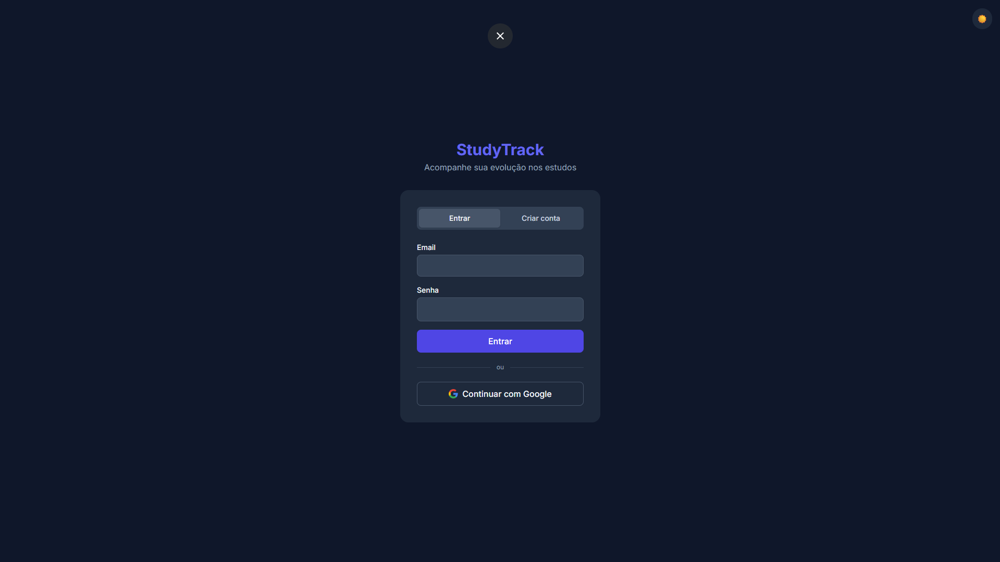
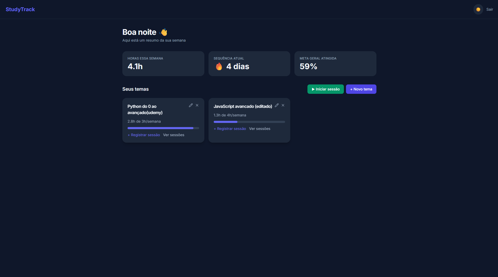
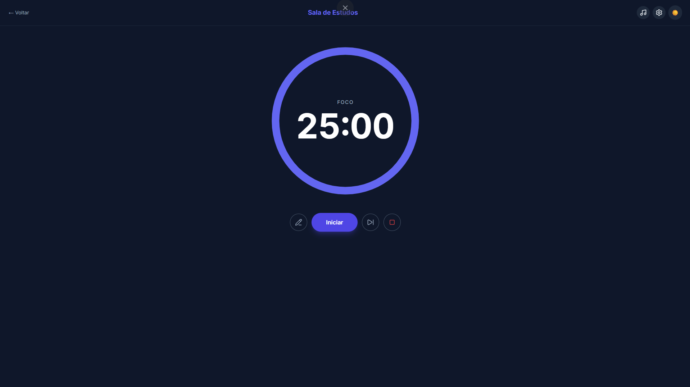
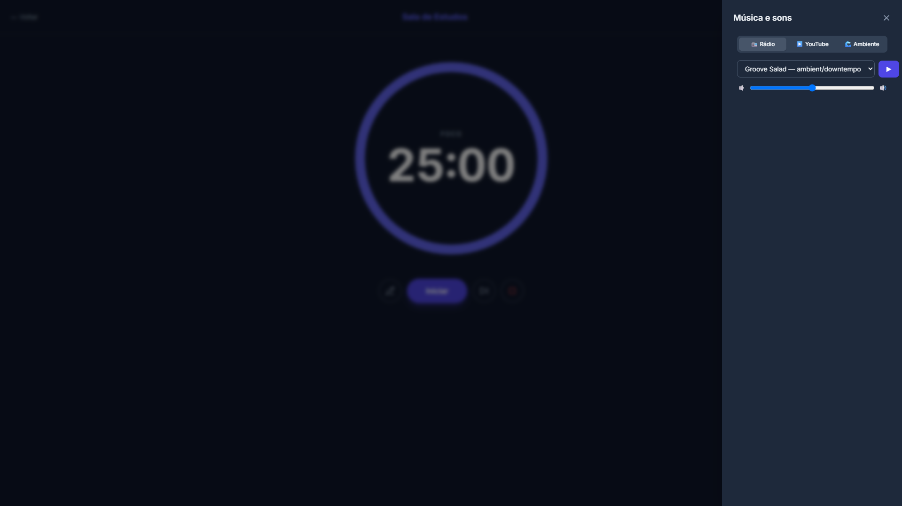
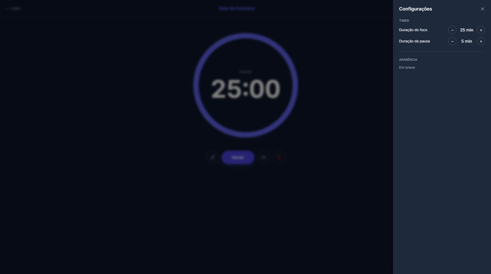

# StudyTrack

🌐 [Ler em Português](README.md)

A personal study-session tracking system — log study topics, record sessions, track your progress with real metrics, and use a built-in study room with a Pomodoro timer and ambient music to stay focused.

Built as a portfolio project, featuring real authentication, a database protected by Row Level Security, and a fully responsive interface built from scratch.

## Screenshots

| Login | Dashboard |
|---|---|
|  |  |

| Study Room | Music Panel |
|---|---|
|  |  |



## Features

- **Real authentication**: email/password sign-up and login, or Google login (via Supabase Auth)
- **Database-level security**: PostgreSQL Row Level Security (RLS) ensures each user can only access their own data, even if the application layer fails
- **Full CRUD for study topics**: create, edit, delete, with weekly hour goals
- **Full CRUD for study sessions**: log, edit, delete, with notes
- **Dashboard with real metrics**: hours studied this week, consecutive-day streak, goal completion percentage — all calculated from real data, not static
- **Study Room**: Pomodoro timer with configurable durations, sound alert and browser notification on phase change, timestamped notes logged throughout the session
- **Focus music and sounds**: live radio (SomaFM), YouTube player with link search, and ambient sounds (white noise/rain) generated via the Web Audio API
- **Light/dark theme** with saved preference
- **Fully responsive**, tested on mobile and desktop

## Tech stack

**Backend**: Node.js, Express 5, Supabase (PostgreSQL + Auth)
**Frontend**: Vanilla HTML/CSS/JavaScript, Tailwind CSS
**Auth**: Supabase Auth (email/password + Google OAuth)
**Icons**: Lucide

## Running locally

### Prerequisites
- Node.js installed
- A free [Supabase](https://supabase.com) account

### 1. Clone the repository
```bash
git clone https://github.com/Leukard/studytrack.git
cd studytrack
```

### 2. Set up the backend
```bash
cd backend
npm install
cp .env.example .env
```
Fill in `.env` with your Supabase project URL and anon key.

Run the table creation and RLS policy SQL (available at `docs/schema.sql`) in your Supabase project's SQL Editor.

```bash
npm run dev
```

### 3. Set up the frontend
```bash
cd ../frontend/js
cp supabaseClient.example.js supabaseClient.js
```
Fill in `supabaseClient.js` with the same URL and key from the previous step.

Open `frontend/index.html` with a Live Server extension (VS Code) or similar.

## Future improvements

- Google Calendar sync
- Task system integrated with the timer
- Customizable study room background images
- Educational section explaining the Pomodoro technique
- Onboarding flow for new users
- Full visual personalization (colors, theme)
- Progress report generation

## Live project

🔗 _coming soon_

---

Built by [Hugo](https://github.com/Leukard) as a portfolio project.